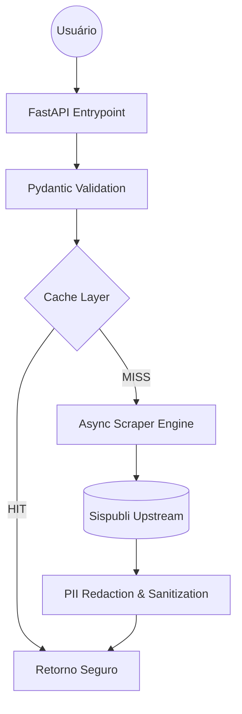

# 🛡️ Sispubli API — Security-First Proxy

> Transformando sistemas legados frágeis em infraestruturas seguras e resilientes.

[](https://www.python.org/downloads/release/python-3130/)
[](https://fastapi.tiangolo.com)
[](https://github.com/astral-sh/uv)
[](https://github.com/astral-sh/ruff)
[](https://docs.pytest.org/)
[](https://vercel.com)

A **Sispubli API** não é apenas um scraper; é uma **barreira de segurança (Security-First Proxy)** projetada para mitigar as fragilidades críticas do sistema Sispubli original. Ela elimina o vazamento de dados sensíveis (PII) durante o compartilhamento de certificados e padroniza o acesso a documentos acadêmicos do Instituto Federal de Sergipe.

---

## 🛡️ Mitigação de Fragilidades Legadas

O sistema legado do Sispubli apresenta vetores de risco que esta API neutraliza proativamente:

| Fragilidade do Sispubli (Cenário Real) | Mitigação Sispubli API (Solução) |
| :--- | :--- |
| **HTTP Sem Criptografia**: Dados trafegam abertos na rede. | **TLS 1.3 / HTTPS**: Túnel seguro de ponta a ponta via Vercel Edge. |
| **CPF Exposto na URL**: Links de certificados compartilham seu CPF. | **URL Ticket Proxy**: O CPF nunca aparece em URLs; usamos tickets efêmeros. |
| **Logs Desprotegidos**: CPFs salvos em texto puro nos logs do servidor. | **PII Redactor**: Interceptor inteligente que mascara CPFs em logs e erros. |
| **Exposição de Memória**: Sessões persistentes em RAM. | **Stateless Strategy**: Processamento efêmero na memória RAM da Vercel. |
| **Falta de Rate Limit**: Vulnerável a extração massiva de dados. | **Aggressive Rate Limiting**: Proteção por IP e por Ticket de documento. |

---

## 📐 Arquitetura de Fluxo e Cache

O sistema foi desenhado sob o padrão de **Vertical Slices**, garantindo que cada fluxo de dados seja isolado e protegido por camadas de validação.



### Estratégia de Disponibilidade e Cache

1. **Public/CDN Cache**: Certificados (PDFs) são cacheados na borda (Edge) por 24h, economizando banda e tráfego upstream.
2. **Private Client Cache**: As listagens de certificados ficam no cache do navegador do usuário por 5 minutos, protegendo dados privados e reduzindo latência.
3. **Optimized Scraping**: Motor de processamento `alru_cache` para evitar parses redundantes durante a mesma sessão.

---

## 🚀 Tecnologias e DX (Developer Experience)

O projeto foi refatorado a partir de uma PoC simples para um ecossistema pronto para produção e serverless.

- **FastAPI / Uvicorn** — Servidor web assíncrono superrápido.
- **Pydantic V2** — Para a validação estrita dos contratos de dados (Schemas/Swagger).
- **uv** — O package manager desenvolvido em Rust, incrivelmente rápido (`pyproject.toml`).
- **Ruff** — Linter e Formatter central usando as regras rigorosas PEP-8 e segurança (Bandit).
- **Loguru** — Formatação customizada com interceptores de privacidade.
- **Vercel Serverless / Docker** — Múltiplos ambientes de deployment.

---

## 🛠️ Como Iniciar Localmente

Para começar a desenvolver ou testar o projeto, você precisará do pacote `uv` instalado na máquina (`pip install uv` ou baixe via brew/curl).

### 1. Clonar e Instalar as Dependências

Não se preocupe com `virtualenv` ou `pip install`, o `uv` lidará com tudo dentro do seu cache global:

```bash
# Clone o repositório
git clone https://github.com/JGustavoCN/sispubli-api.git
cd sispubli-api

# Execute a instalação sincronizada
make install
```

### 2. Configure Suas Variáveis de Ambiente

Copie o arquivo de exemplo e preencha com seus dados locais:

```bash
cp .env.example .env
```

```ini
# .env
CPF_TESTE=74839210055   # Substitua pelo seu CPF real (apenas para testes E2E)
HASH_SALT=seu_salt_secreto_aqui
```

> [!CAUTION]
> O CPF real é necessário **apenas** para testes E2E (`make test-e2e`). Para testes unitários (`make test`) e desenvolvimento local (`make serve`), nenhum CPF real é necessário.
> **NUNCA** insira seu CPF diretamente no código-fonte. Use exclusivamente o `.env`.

### 3. Rodando o Servidor Localmente

Basta usar a cadeia do Uvicorn já abstraída:

```bash
make serve
```

A API subirá na porta 8000: `http://localhost:8000`. Teste o acesso ao `/docs` para ver o esquema Swagger.

---

## ⚙️ Scripts Disponíveis (Makefile)

O projeto foi idealizado para conter todas as complexidades encapsuladas no `Makefile`:

| Comando | Descrição Completa |
| --------- | -------------------- |
| `make install` | Sincroniza e trava as dependências limpas do ambiente com o `uv sync`. |
| `make format` | Roda o formatador Python do pacote *Ruff* de forma agressiva nos padrões. |
| `make lint` | Executa o linter *Ruff* apontando vulnerabilidades, complexidade e typehints. |
| `make test` | Roda a suíte do `pytest-cov`, isolada sem atingir a máquina do Sispubli. |
| `make test-v` | Mesma função do testamento, adicionando níveis de debug com o `loguru`. |
| `make test-e2e` | Ousado. Roda a API *Scraper* real. Conecta e valida o servidor upstream real. |
| `make serve` | Bota no ar o Uvicorn na sua máquina pronta com recarga on the fly. |
| `make docker-build` | Executa a compilação do `Dockerfile` criando dependências fixas do Unix. |
| `make docker-run` | Sobe o container, expondo a porta `8000` em um shell limpo. |
| `make check` | Agrega `make lint` e `make test`. Executa tudo o que as GitHub Actions fariam. |
| `make clean` | Expurga cache e diretórios de relatórios temporários. |

---

## 📡 Referência Rápida da API (Endpoints)

### `GET /` (Health Check)

Garante a conectividade imediata do container e instâncias Serverless.

- **Response HTTP 200**: `{"status": "API do Sispubli rodando"}`

### `POST /api/auth/token` (Login)

Gera um token de sessão seguro (Fernet) com validade efêmera para um CPF.

- **Request Body**: `{"cpf": "74839210055"}`
- **Response HTTP 200**: `{"access_token": "eyJhbG..."}`

### `GET /api/certificados` (Listagem Segura)

Lista todos os certificados. Utiliza o padrão **URL Template/Ticket** para os links de download (PDFs servidos pelo túnel `/api/pdf/{ticket}`).

- **Header**: `Authorization: Bearer <seu_token>`
- **Response HTTP 200**:

```json
{
  "data": {
    "usuario_id": "***.839.210-**",
    "total": 3,
    "certificados": [
      {
         "id_unico": "hash_sha256_do_certificado",
         "titulo": "Participação no(a) SEPEX 2023",
         "url_download": "/api/pdf/f81...a3b",
         "ano": 2023,
         "tipo_codigo": 1,
         "tipo_descricao": "Participação"
      }
    ]
  }
}
```

> [!NOTE]
> Observe o campo `url_download`: o CPF real foi substituído por um ticket criptografado de uso único, protegendo a identidade ao compartilhar o link.

---

## 🔒 Segurança e Blindagem PII (Zero Trust)

O projeto prioriza a segurança dos dados (LGPD) através de uma arquitetura "Zero PII Leak":

- **Validação Matemática (Módulo 11)**: Todo CPF é validado matematicamente via Pydantic. Entradas inválidas retornam `422` imediatamente.
- **Sanitização de Mocks (VCR)**: Hooks de filtragem garantem que CPFs (em URIs, Bodies ou Headers) nunca sejam persistidos nos cassettes de teste.
- **Auditoria Dinâmica**: Script `make audit` bloqueia o fluxo caso detecte segredos ou CPFs reais no repositório.

---

## 🧪 Qualidade de Código

- **Cobertura Total: 91%** 📈 (Testado via `pytest-cov`)
- **Pirâmide de Testes**:
  - **Unitários**: Validadores puros e Parsers de HTML.
  - **Integração**: Testes de túnel com mocks dinâmicos (`vcrpy`).
  - **End-to-End**: Validação real contra o Sispubli.

---

## 📦 Implantação e Deployment

### Via Vercel (Serverless)

O projeto acompanha o config `vercel.json` que aciona o Builder Python da Vercel.

```bash
vercel --prod
```

### Via Containerization (Docker)

Imagens superfinas baseadas no `python:3.13-slim` preparadas para AWS, Digital Ocean ou Kubernetes.

```bash
make docker-build
make docker-run
```
